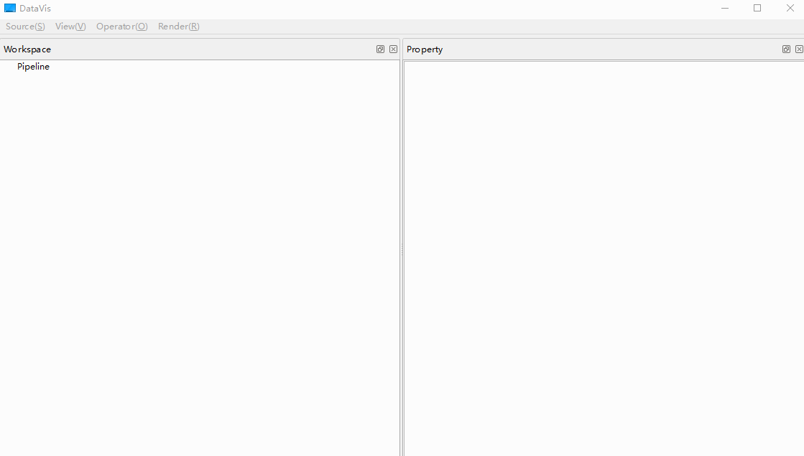

# DataVis

#### 介绍
用于流数据的实时分析与显示。

#### 依赖库
- [blitz](https://github.com/blitzpp/blitz)
- [exprtkX](https://gitee.com/koala999/exprtk-x)
- [KDDockWidgets](https://github.com/KDAB/KDDockWidgets)
- [kfr](https://www.kfr.dev/)
- [libsndfile](http://libsndfile.github.io/libsndfile/)
- [praat](https://www.fon.hum.uva.nl/praat/)
- [QCustomPlot](https://www.qcustomplot.com/)
- [QtnProperty](https://github.com/koala999cn/QtnProperty)
- [rtaudio](http://www.music.mcgill.ca/~gary/rtaudio/)
- [smarc](http://audio-smarc.sourceforge.net/)

#### 编译
Qt6 + MSVC2019

#### ScreenShots

线形图演示：

柱状图演示：

颜色映射图演示：

