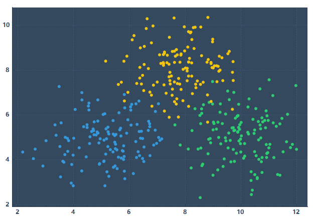
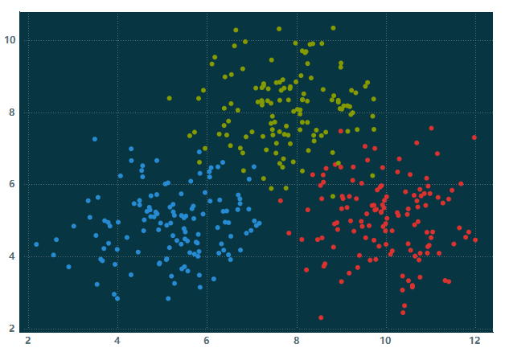

# DataVis

### 介绍
用于流数据的实时分析与显示。主要专注于两方面：一是数据可视化，通过内置主题提供专业化的绘图功能；二是流分析，通过pipeline组合各种功能模块，对各类动态数据提供在线分析和结果演示。

### 编译
Qt6 + MSVC2019

### 主题
目前，已实现ggthemr所有plotting主题，各主题样例如下。详细可参考[ggthemr开源页面](https://github.com/Mikata-Project/ggthemr)。

#### camouflage

#### carrot

#### chalk

#### citrus

#### copper

#### deadpool

#### dust

#### earth

#### flat dark

#### flat

#### fresh

#### grape

#### grass

#### greyscale

#### light

#### lilac

#### pale

#### pink

#### sea

#### sky

#### solarized dark

#### solarized

#### dracula

### ScreenShots

线形图演示：

柱状图演示：

颜色映射图演示：

### 依赖库
- [blitz](https://github.com/blitzpp/blitz/) - inline，无须单独编译
- [exprtkX](https://gitee.com/koala999/exprtk-x/)
- [KDDockWidgets](https://github.com/KDAB/KDDockWidgets/)
- [kfr](https://www.kfr.dev/) - inline，无须单独编译
- [libsndfile](http://libsndfile.github.io/libsndfile/)
- [praat](https://www.fon.hum.uva.nl/praat/) - inline，无须单独编译
- [QCustomPlot](https://www.qcustomplot.com/)
- [QtnProperty](https://github.com/koala999cn/QtnProperty/)
- [readerwriterqueue](https://github.com/cameron314/readerwriterqueue/) - inline，无须单独编译
- [rtaudio](http://www.music.mcgill.ca/~gary/rtaudio/)
- [smarc](http://audio-smarc.sourceforge.net/)