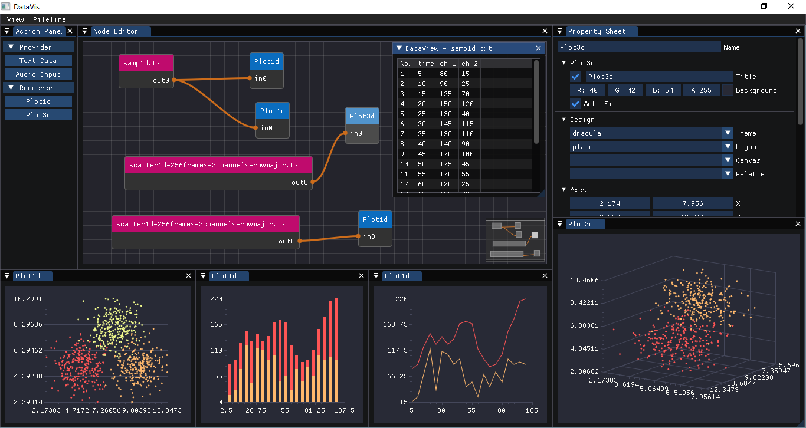

# DataVis

## 介绍

主要用于流数据的实时分析与显示。重点专注于两方面：一是数据可视化，通过内置主题提供专业化的绘图功能；二是流分析，通过pipeline组合各种功能模块，对各类动态数据提供在线分析和结果演示。
界面如下：

 

## 新特性

v0.4版对底层代码作了较大重构，主要有4方面：

- 使用ImGui作为界面库，不再依赖Qt

- 统一2d/3d绘图接口并内置实现，不再依赖外部库

- 使用节点编辑器构造网状拓扑结构，不再使用树形结构

- 全面引入pipeline概念，支持复杂的数据流程

目前，暂未完全重构0.3版的功能，主要缺失operator和部分provider，下步将尽快恢复。

## 使用

主要分3步：

一是构造pipeline，通过ActionPanel新增provider和renderer节点，在NodeEditor中建立拓扑链接；

二是配置pipeline，选中node节点，在PropertySheet中进行参数设定，部分参数可也后期调整；

三是运行pipeline，点击主菜单pipeline的start选项。

此外，双击node节点可查看即时输出数据。

## 依赖库

| 库名称 | 作用 | 编译 |
|---|---|---|
| [ImGui](https://github.com/ocornut/imgui) | 界面显示 | 已内嵌 |
| [glfw](https://github.com/glfw/glfw) | ImGui依赖 | 单独编译 |
| [imnodes](https://github.com/Nelarius/imnodes) | 节点编辑器 | 已内嵌 |
| [ImFileDialog](https://github.com/dfranx/ImFileDialog) | 文件对话框 | 已内嵌 |
| [stb_image.h](https://github.com/nothings/stb/blob/master/stb_image.h) | ImFileDialog依赖 | 已内嵌 |
| [glad](https://github.com/Dav1dde/glad) | ImFileDialog依赖 | 单独编译 |
| [nlohmann](https://github.com/nlohmann/json) | 解析theme文件 | 已内嵌 |
| [blitz](https://github.com/blitzpp/blitz/) | 多维数组支持 | 已内嵌 |
| [rtaudio](http://www.music.mcgill.ca/~gary/rtaudio/) | Audio录放 | 单独编译 |
| [exprtk](http://www.partow.net/programming/exprtk/) | 数学表达式 | 内嵌子项目 |
| [kfr](https://www.kfr.dev/) | 滤波器支持 | 已内嵌 |

## 编译

编译器使用VC2019，预编译的64位依赖库可在[附件页面下载](https://gitee.com/koala999/data-vis/attach_files)。